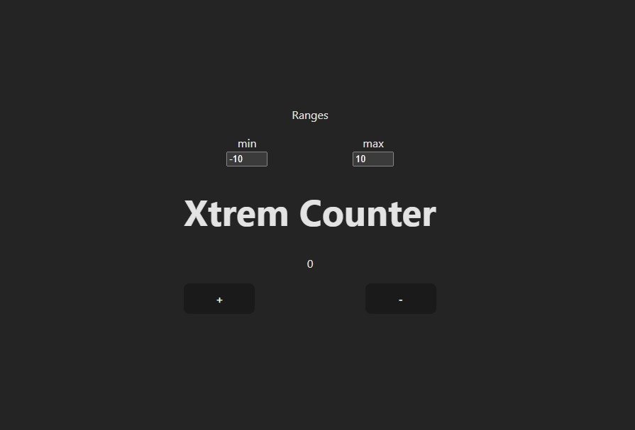

# Counter App

A simple React counter application that allows you to set minimum and maximum values.

## Project Overview

This project is a React application that features a counter component with adjustable minimum and maximum values. Users can increment and decrement the counter within the specified range.



## Features

- Increment and decrement the counter.
- Set minimum and maximum values to restrict the counter range.

## Getting Started

### Prerequisites

- Node.js and npm installed on your machine.

### Installation

1. Clone the repository:

    ```bash
    git clone https://github.com/TayyabXtreme/ReactPracticeProjects.git
    ```

2. Navigate to the project directory:

    ```bash
    cd counter-app
    ```

3. Install the dependencies:

    ```bash
    npm install
    ```

### Running the Application

To start the development server:

```bash
npm start
