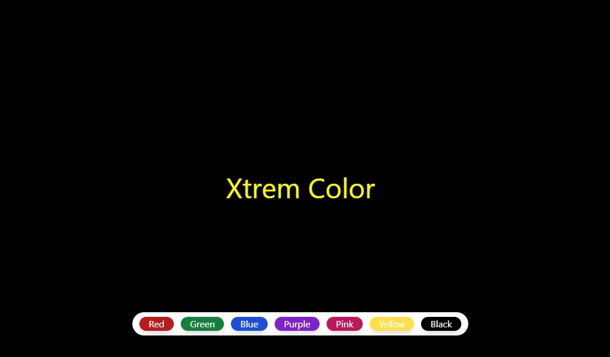

# React Background Changer

This is a simple React project that changes the background color of the webpage when a button is clicked.

## Features

- Change the background color by clicking a button.
- Different colors for each button click.
- Easy to customize and extend with additional colors and features.

## Demo



## Installation

1. Clone the repository:
    ```bash
    git clone https://github.com/TayyabXtreme/ReactPracticeProjects.git
    cd react-background-changer
    ```

2. Install the dependencies:
    ```bash
    npm install
    ```

## Usage

1. Start the development server:
    ```bash
    npm start
    ```

2. Open your browser and go to `http://localhost:3000`.

3. Click any button to change the background color.

## Customization

You can customize the colors and buttons by modifying the `App.js` file.

```javascript
import { useState } from 'react'


function App() {
  const [color, setcolor] = useState("white")
  const [textColor, settextColor] = useState("black")
  
  const bgChange=(col)=>{   
   
    
    setcolor(col)
    if (col === textColor ) {
      settextColor('white');
    } else {
      settextColor(color);
    }
    
  }
  return (
   
     <div className='w-full h-screen' style={{background:color}}>
      <h1 className='text-5xl fixed flex-wrap flex justify-center top-1/2 inset-x-0 px-2' style={{color :textColor}}>Xtrem Color</h1>
      <div className='fixed flex-wrap flex justify-center bottom-12 inset-x-0 px-2'>


        <div className="flex flex-wrap justify-center gap-3 shadow-lg bg-white px-3 py-2 rounded-3xl">
        <button className='bg-red-700 px-4 outline-none rounded-full text-white shadow-lg' onClick={()=>bgChange('red')}>Red</button>
        <button className='bg-green-700 px-4 outline-none rounded-full text-white shadow-lg' onClick={()=>bgChange('green')}>Green</button>
        <button className='bg-blue-700 px-4 outline-none rounded-full text-white shadow-lg' onClick={()=>bgChange('blue')}>Blue</button>
        <button className='bg-purple-700 px-4 outline-none rounded-full text-white shadow-lg' onClick={()=>bgChange('purple')}>Purple</button>
        <button className='bg-pink-700 px-4 outline-none rounded-full text-white shadow-lg' onClick={()=>bgChange('#e75480')}>Pink</button>
        <button className='bg-yellow-300 px-4 outline-none rounded-full text-white shadow-lg' onClick={()=>bgChange('yellow')}>Yellow</button>
        <button className='bg-black px-4 outline-none rounded-full text-white shadow-lg' onClick={()=>bgChange('black')}>Black</button>

        </div>


      </div>

     </div>
    
  )
}

export default App
