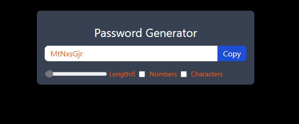

# Password Generator

A simple password generator built using React. This application allows users to generate random passwords based on selected criteria such as length, inclusion of uppercase letters, numbers, and special characters.

## Features

- Generate passwords of varying lengths
- Include or exclude uppercase letters, numbers, and special characters
- Copy generated password to clipboard

## Screenshots



## Getting Started

Follow these instructions to get a copy of the project up and running on your local machine for development and testing purposes.

### Prerequisites

Make sure you have Node.js and npm installed on your system. You can download Node.js from [here](https://nodejs.org/).

### Installation

1. Clone the repository:
    ```bash
    git clone https://github.com/TayyabXtreme/ReactPracticeProjects.git
    ```

2. Navigate to the project directory:
    ```bash
    cd xtrempasswordgenerator
    ```

3. Install the dependencies:
    ```bash
    npm install
    ```

### Running the Application

To start the development server, run:
```bash
npm start
